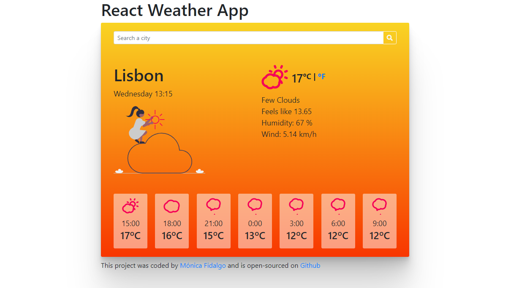
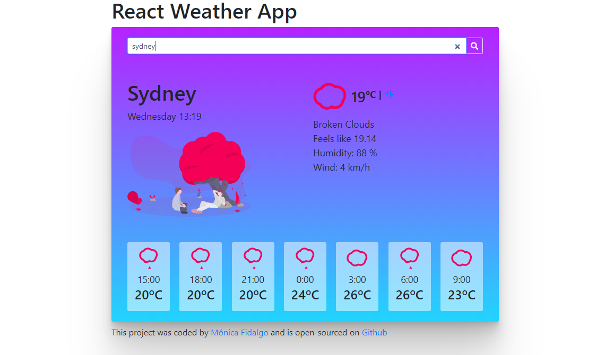

# React Weather App

## About

Search for a city weather using this cool react app see the forecast and check how the app mood changes

## Technologies

- React.js
- JavaScript
- Bootstrap 4

## Dev Details

- This project uses the openweather API to get the city weather and city forecast
- Fontawesome was imported
- react-animated-weather icons node package was use to get the icons
- For the API calls, axios was installed
